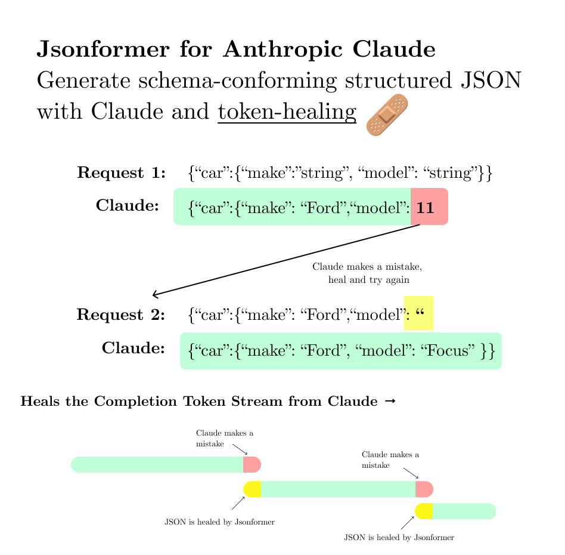

# Jsonformer Claude: Generate Schema-conforming Structured JSON from Anthropic's Claude Model

Generating structured JSON from language models can be a challenging task. The generated JSON must be syntactically correct and follow a schema that specifies the structure of the JSON.

Jsonformer Claude is a library based on Jsonformer that works with Anthropic's language models to generate JSON data following a given schema. Jsonformer Claude works great with very complex schemas.

Most importantly, Jsonformer Claude minimizes network round trips, and only makes new requests to Claude when an error is encountered. This makes it much more efficient than generating a full JSON string and parsing it, then retrying if the JSON is not valid.

<!-- add img/demo.png -->

### Features

- Robust JSON generation: Jsonformer Claude ensures that the generated JSON is always syntactically correct and adheres to the specified schema.
- Efficiency: Jsonformer Claude generates only the content tokens and fills in the fixed tokens, making it more efficient than generating a full JSON string and parsing it.
- Compatible with Anthropic models: Jsonformer Claude is designed to work with Anthropic's Claude model for JSON generation.
- Impressive results for complex data: Jsonformer Claude has demonstrated its capability to generate structured JSON data representing the characters of entire books, such as "The Great Gatsby", highlighting its robustness and effectiveness.

### Supported schema types

Jsonformer Claude currently supports a subset of JSON Schema. Below is a list of the supported schema types:

- number
- boolean
- string
- array
- object

## Example Usage: The Great Gatsby

```python
import asyncio
import anthropic

from jsonformer_claude.main import JsonformerClaude

# Replace with your Anthropic API key
api_key = "your-anthropic-api-key"

# Create an Anthropic client
client = anthropic.Client(api_key)

# Define the JSON schema
json_schema = { ... }

# Define the prompt
prompt = "Generate a JSON representation of the main characters in The Great Gatsby based on the following schema:"

# Create a JsonformerClaude instance
gen_json = JsonformerClaude(
    anthropic_client=client,
    json_schema=json_schema,
    prompt=prompt
)

# Generate structured JSON data representing main characters in "The Great Gatsby"
generated_data = await gen_json()

print(generated_data)
```

**Generated Output:**

```json
{
  "title": "The Great Gatsby",
  "characters": [
    {
      "name": "Jay Gatsby",
      "description": "The main character of the novel. A wealthy, mysterious millionaire who is obsessed with Daisy Buchanan."
    },
    ...
  ]
}
```

Jsonformer Claude was able to generate detailed structured JSON data for the major characters in "The Great Gatsby". 

## Installation

```bash
pip install jsonformer-claude
```

## Development

To develop and contribute to Jsonformer Claude, ensure you have [Poetry](https://python-poetry.org/docs/#installation) installed for dependency management.

```bash
poetry install
```

```bash
poetry run python -m jsonformer_claude.example
```

## License

Jsonformer Claude is released under the MIT License. You are free to use, modify, and distribute this software for any purpose, commercial or non-commercial, as long as the original copyright and license notice are included.